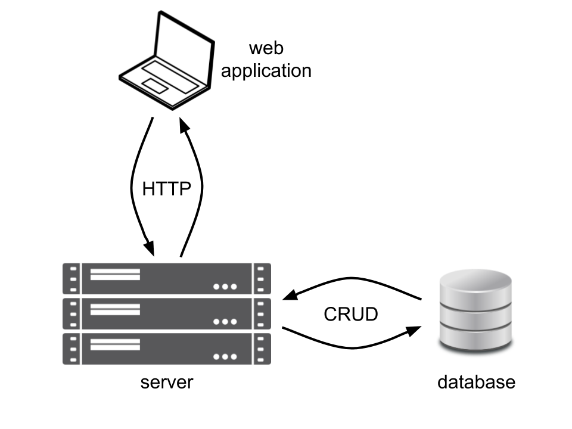

```{r setup, include=FALSE}
knitr::opts_chunk$set(echo = TRUE, fig.align = 'center')
```

# Learning Objectives<br>

* Know how `SQL` is related to relational database systems
* Understand the structure of a relational database in terms of tables, columns and rows
* Be able to describe the CRUD operations
* Understand why table relationships arise and see an example relationship

**Duration - 20 minutes**<br>

# Introduction

## What is a database?

A database is just somewhere for us to store our data. There are many different shapes, sizes and types of database. The **'relational'** database is one particularly popular and widely used type, and `SQL` is a language which is often used to query and modify relational databases. We'll explain more about what this term 'relational' means below. 

## What sort of data do we store in databases?

<br>
<blockquote class="task">
**Task - 2 mins** 

Have a think about and discuss with the people around you some examples of data you might store in a database.

<details>
<summary>**Solution**</summary>
The possibilities are truly vast: 

* Customers, customer orders, supplier and stock for retail operations.
* Climate sampling sites and climate data gathered there. 
* Membership of a society.
* Financial transactions stored against bank accounts or credit cards.
</details>
</blockquote>
<br>

## What is `SQL`?

`SQL` stands for "Structured Query Language" (pronounced either as "ess-queue-ell" or "sequel"). There are number of different 'versions' of `SQL` in common use: some freely available and others proprietary. `PostgreSQL` is an open-source object-relational database system, and this is the system we will be using on the course, but you should be aware there are lots of different DB systems out there: `MySQL`, `Oracle`, `SQL Server` etc... Some of these are commercial offerings, while others are open-source. 

You may often hear these database systems referred to as **RDBMS**s. This stands for 'Relational DataBase Management System', and is just a fancy way of saying a 'relational database', or sometimes even a '`SQL` database'.

The core functionality of `SQL` is specified in a **standards document** historically produced by the American National Standards Institute (ANSI), and more recently by the International Standards Organisation (ISO). The standard is still often called **'ANSI `SQL`'**. The most recent standard came out in 2016 (SQL:2016 or ISO/IEC 9075:2016). 

Most RDBMSs offer a **subset** of ANSI `SQL` together with some other features specific to each system. This is how commercial RDBMS vendors make their money: each RDBMS becomes well known for offering features or performance (often in niche applications) not available in competing systems. 

We will use the `PostgreSQL` RDBMS in this course, but the `SQL` commands and concepts we'll cover lie well within 'core `SQL`'; you will be able to run all of what follows (or straightforward modifications of it) within every RDBMS!

## What sorts of operations do we perform upon data in databases?

Operations belong to one of the following categories:

| Operation | Description | `SQL` command |
|---|---|---|
| Create | Add data to a database | `INSERT` |
| Read | View or extract data (this operation is key for analysts) | `SELECT` |
| Update | Occasionally, we may need to change data | `UPDATE` |
| Delete | Occasionally, we may need to remove data | `DELETE` |

We collectively refer to these four operations as **"CRUD"**. As data analysts, we are naturally most interested in **Read**-ing from databases: we want to extract data from a database and either view it directly in a database client application or import it into an analysis environment (`R`, `Python`, `Tableau`, `PowerBI` etc). 

Often **Create**, **Update** and **Delete** access to databases will be restricted by a **database administrator**, as these are more 'risky' operations from the point of view of data integrity. Typically, only selected users will be given these privileges, and the majority of users will be limited to **Read** operations.

Another note: it is now far more common for **other pieces of software** (rather than human agents) to perform these operations on a database. As an example, consider ordering something from an online store. You interact with a **web app**, the web app in turn interacts with **server** software, and the server is responsible for **Create**-ing a new order in the database, **Update**-ing your user record to add the order to it, **Update**-ing the stock database to indicate the purchase of a stock item, etc. Users typically do not interact with database directly, but rather via intermediate software.      

```{r, echo=FALSE, fig.cap="Application, server and database", out.width = '60%'}

```

# Database structure

In an RDBMS, each **database** is a collection of **tables**. A table is a collection of **columns** and **rows**.

* A **table** describes the type of item that we want to store. 
* A **column** represents some property of interest about that item. 
* A **row** represents one particular example of that item.

For example, we might have a `zoo` database with a table called `animals`. The `animals` table might have the columns `name`, `age` and `species`, and we'll also add in an `animal_id` column to keep track of individual animals. The `animals` table would then look like:

| `animal_id` | `name` | `age` | `species` |
| --- | --- | --- | --- |
| 1 | Leo | 12 | Lion |
| 2 | Tony | 8 | Tiger |
| 3 | Matilda | 6 | Cow |
| 4 | Bernice | 12 | Bear |

Each **row** represents an individual item (an animal in this case), and each **column** is a property of an item (e.g. an animals `name`).  Note: a column is sometimes referred to as a **field**, and a row as a **record**, but the terms are completely interchangeable.

## Table relationships

'Relational' databases get that way because very often they contain tables that are **related** to each other in some fashion. You have seen similar concepts already in the earlier `dplyr` when we thought about how tibbles can be **related** to each other by values held in columns.  

Let's see an example of how a relationship between tables could arise. Imagine we expand our `zoo` database by adding a `diets` table to help the zookeepers track what to feed each animal.

| `diet_id` | `diet_type` |
| --- | --- |
| 1 | herbivore |
| 2 | carnivore |
| 3 | omnivore |

So far so good. But now we need to say **which diet each animal should receive**...


<br>
<blockquote class="task">
**Task - 2 mins** 

Think of the two tables we have in the database so far: `animals` and `diets`. Can you see how to change the database to indicate **which diet each animal in the `zoo` should receive**?

<details>
<summary>**Hint**</summary>
We need to add something to the `animals` table. Can you think what?
</details>

<details>
<summary>**Solution**</summary>
We need to **add an extra column** to the `animals` table, like so:

| `animal_id` | `name` | `age` | `species` | `diet_id` |
| --- | --- | --- | --- | --- |
| 1 | Leo | 12 | Lion | 2 |
| 2 | Tony | 8 | Tiger | 2 |
| 3 | Matilda | 6 | Cow | 1 |
| 4 | Bernice | 12 | Bear | 3 |

This establishes a **relationship** between the two tables! Every row in the `animals` table is now linked to a row in the `diets` table. 
</details>
</blockquote>
<br>

## Column types

You'll see above that each column of a table holds a particular **type** of data. For example, `name` and `species` seem to be text type, whereas `animal_id`, `age` and `diet_id` are number types. In fact, the most common data types in `PostgreSQL` are: 

* `VARCHAR` - fixed length text (string)
* `INT` - integer numerical data
* `REAL` - continuously valued numerical data
* `BOOLEAN` - true / false data 
* `TIMESTAMP` - date and time information

In `SQL`, each column is restricted to hold data of one particular type, and the column types are set when the table is created (although they can be changed later).

<br>
<blockquote class="task">
**Task - 2 mins** 

Have a look at the following items of data we might want to store in a retail database. Which of the `PostgreSQL` data types above best matches their contents?

* `total` = 24.79
* `loyalty_card` = TRUE
* `purchased_on` = 2017-12-22
* `customer_name` = 'Alice Barwell'
* `number_of_items` = 10

<details>
<summary>**Solution**</summary>

* `REAL`
* `BOOLEAN`
* `TIMESTAMP`
* `VARCHAR`
* `INT`

We can specify a value after `VARCHAR` to say how large we want the data in the field to be at a maximum, e.g. `VARCHAR(50)` would restrict each value in this column to contain text no longer than 50 characters.  
</details>
</blockquote>


