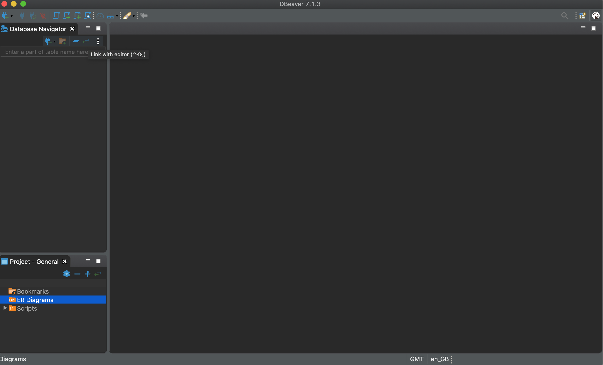
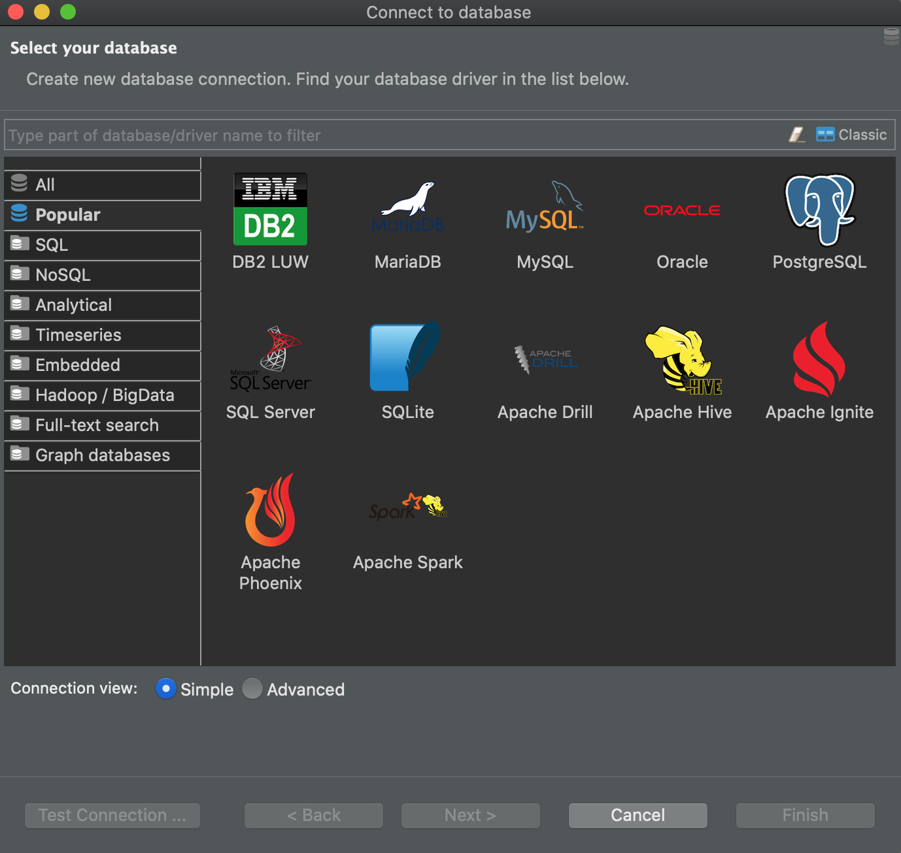
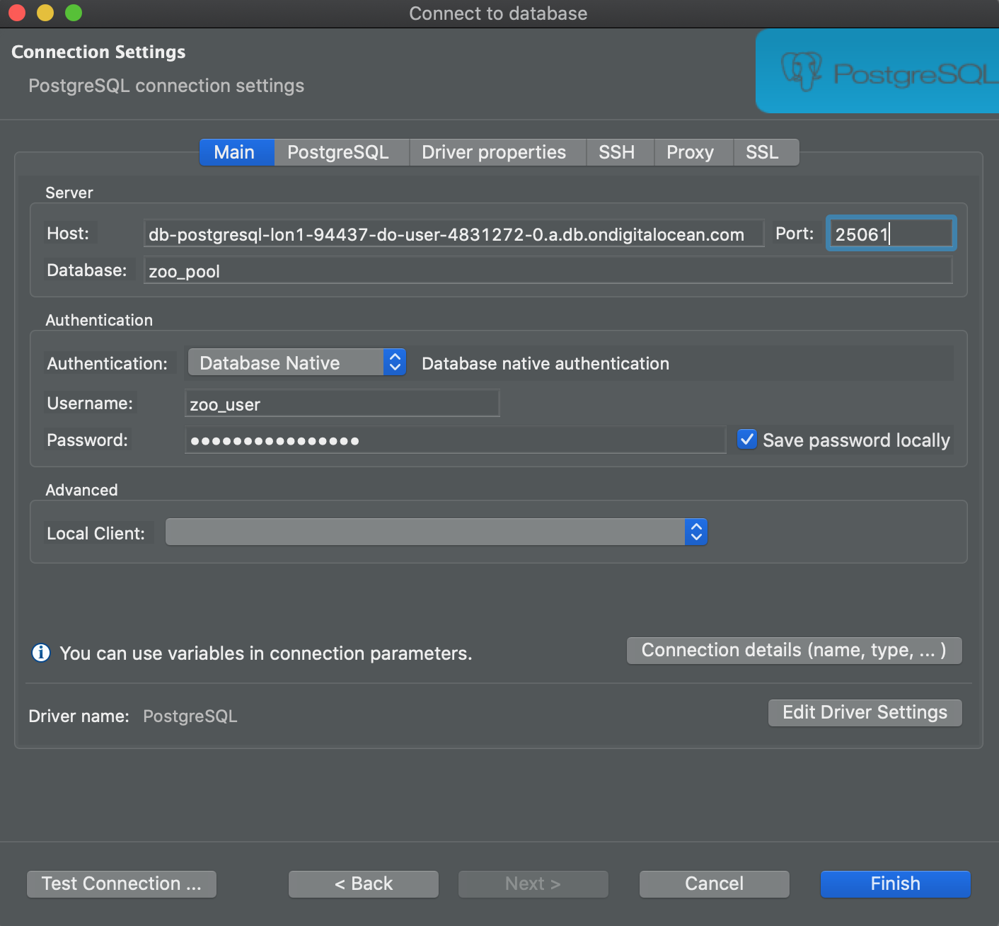
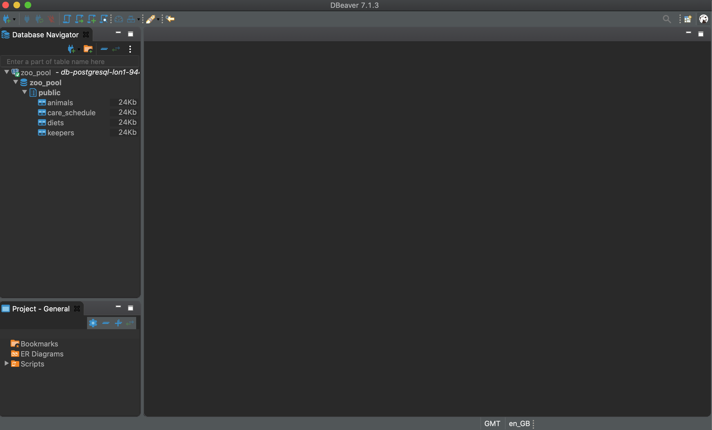
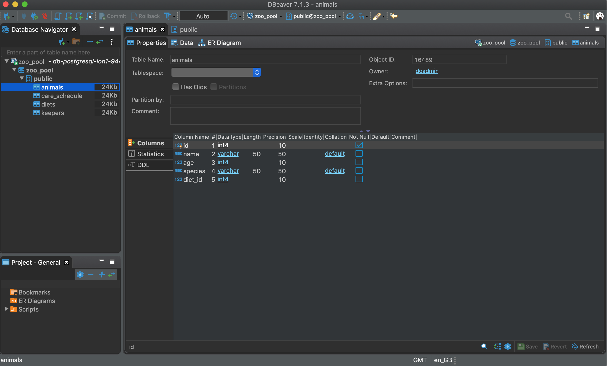
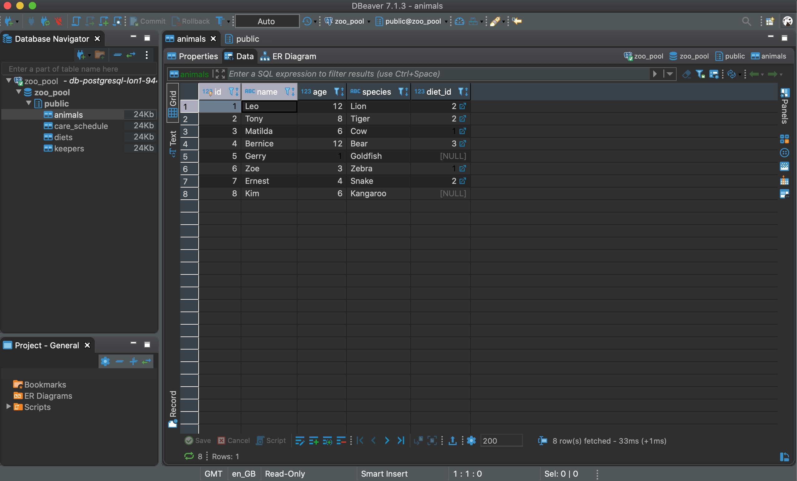
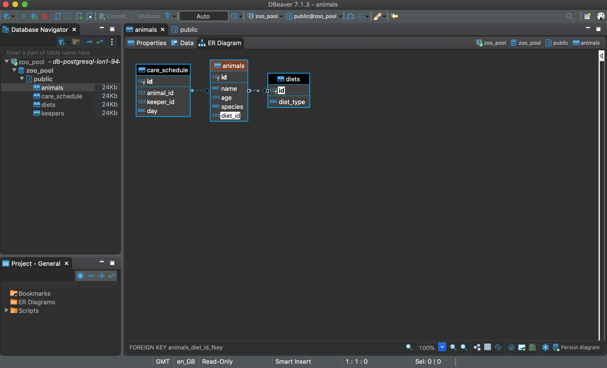
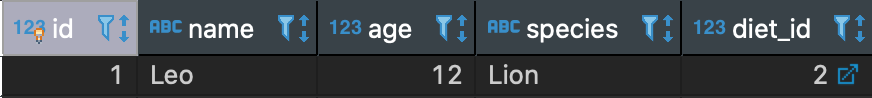
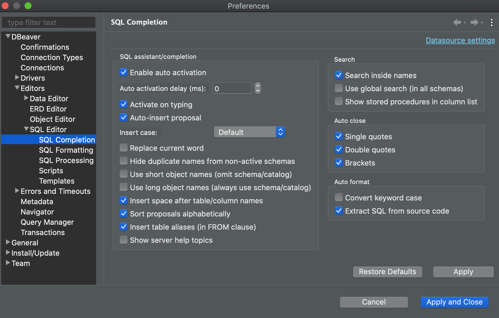

```{r setup, include=FALSE}
knitr::opts_chunk$set(echo = TRUE, fig.align = 'center')
```

# Learning Objectives<br>

* Be able to connect the `DBeaver` tool to a remote `PostgreSQL` database
* Explore tables in the database
* Perform a simple query

**Duration - 30 minutes**<br>

# Creating a new connection

Open the `DBeaver` application on your computer. Depending on your prior use of `DBeaver` before the start of the course, you may see a view something like this, or it may take you straight to the `Connect to database` page below.

It may also ask if you would like to create a sample database, just click `No`.

```{r, echo=FALSE, fig.cap="DBeaver start screen.", out.width = '100%'}

```

If you don't see the `Connect to database` window, click on the `New Database Connection` icon (**plug symbol with a + sign**).

## Connect to database

You should see the `Connect to database` window shown below.

```{r, echo=FALSE, fig.cap="Creating a connection.", out.width = '100%'}

```

Click on the `PostgreSQL` elephant icon, as we are going to connect to a remote `PostgreSQL` database. 

## Enter database connection settings

Enter the database settings shown below into the matching spaces in the form:

| Connection setting | Value |
|---|---|
| Username | zoo_user |
| Password | d0vbgcf0oy09pg7e |
| Host | db-postgresql-lon1-94437-do-user-4831272-0.a.db.ondigitalocean.com |
| Port | 25061 |
| Database | zoo_pool |

```{r, echo=FALSE, fig.cap="Entering connection settings.", out.width = '80%'}

```

Click on `Test Connection`. At this point `DBeaver` may ask you to download drivers, just click `Download`, and then, if necessary, click on `Test Connection` again. If the connection is successful, click on `Finish`. If not, check your connection settings are correct and try again.

## Connect to database

Now you are good to get started! Double-click on the `zoo_pool` connection in the `Database Navigator` pane on the left. After a brief delay, you should see the `zoo_pool` database appear (this looks like a stacked cylinder). Next, click on `public`, and you should see a list of the tables in the database: `animals`, `care_schedule`, `diets` and `keepers`.

```{r, echo=FALSE, fig.cap="Click down through the `zoo_pool` database into the `public` schema to see the tables.", out.width = '100%'}

```

## Exploring tables

### Properties

Double-click on the `animals` table and then select the `Properties` tab

```{r, echo=FALSE, fig.cap="Select the `Properties` tab of the `animals` table.", out.width = '100%'}

```

Here you can see the **columns** (AKA **fields**) of the table, their names and data types. We see that `id`, `age` and `diet_id` are **INT** type and `name` and `species` are **VARCHAR** (text) type, with a limit of 50 characters.

### Data

Next, click on the `Data` tab, you will see a tabular representation of the data held, it looks something like a spreadsheet view. This can be very helpful just to get a quick overview of your data! 

```{r, echo=FALSE, fig.cap="Select the `Data` tab of the `animals` table.", out.width = '100%'}

```

### Entity relationship diagram

Finally, select the `ER Diagram` tab, you will see a so-called entity relationship diagram showing the selected table (`animals` in this case), and its relationship with other tables in the database. In this case we see `animals` is related to the `diets` and `care_schedule` tables. 

```{r, echo=FALSE, fig.cap="Select the `ER Diagram` tab of the `animals` table, then click the link between `animals` and `diets`.", out.width = '100%'}

```

Click on the link between `animals` and `diets`: you will see that column `diet_id` in `animals` is linked to column `id` in `diets`. Don't worry about the `care_schedule` table for now: we'll come back to that tomorrow.

<br>
<blockquote class="task">
**Task - 5 mins** 

Perform a similar exploration of the `diets` table. Answer the following questions:

* What columns does the table contain? What are their data types?
* How many rows of data does the table contain?
* What other tables is `diets` related to?

<details>
<summary>**Solution**</summary>

* `id` is an `INT` and `diet_type` is a `VARCHAR(50)`.
* 4 rows.
* `diets` is related to `animals` alone.
</details>
</blockquote>
<br>

# Primary keys and foreign keys

This relationship between the `animals` and `diets` tables is set up by linking `diet_id` in `animals` with `id` in `diets`. Both of these columns are examples of what is known as **keys** in `SQL`. There are two types of key:

| Key | Description |
|---|---|
| Primary | Often the `id` column of a table. A unique value for each row that cannot be blank (`NULL`). The primary key gives us a way to uniquely identify a particular row in a table. |
| Foreign | A column in a table containing the **primary key of another table**. This is what establishes the link between a row in one table, and another row in a second table. |

So: 

* `id` in `diets` is a **primary key**
* `diet_id` in `animals` is a **foreign key**

Let's look at row 1 in `animals`: 

```{r, echo=FALSE, fig.cap="First row of the `animals` table.", out.width = '80%'}

```

We see that the foreign key column `diet_id` contains a value of '2', telling us that Leo the Lion is linked to the row with `id` '2' in `diets`:

```{r, echo=FALSE, fig.cap="First two rows of the `diets` table.", out.width = '40%'}
knitr::include_graphics("images/diets_row_2.png")
```

So Leo is a carnivore.

# Simple queries

Yay! Let's run our first `SQL` query! Click on your connection to `zoo_pool` in the `Database Navigator` pane on the left, and then on the icon above that looks like a piece of parchment, or in the Menus go to `SQL Editor > SQL Editor`. You should see a blank editor appear.

The reason we clicked on `zoo_pool` is that these `SQL` scripts are **associated with particular connections**. In effect, `DBeaver` remembers that the script we are about to write should be run using the connection to `zoo_pool`. You will see that `<zoo_pool>` is shown at the top of the script tab.

Let's save your script as `first_script`. Go to `File > Save As` and then enter `first_script` in the `Save As:` box (the `.sql` extension will be added automatically). By defult, scripts will save to your home directory. You can either move them later or change where you save them now, as you prefer.

When typing `SQL` queries, it is common to **capitalise** `SQL` commands to make them stand out from column names and other values. Let's change the Editor settings so that it doesn't change the case of the text we type. In the Menus, go to `DBeaver > Preferences...` and then go to the `SQL Completion` tab shown below. Uncheck the option `Convery keyword case` on the lower right. Click `Apply and Close`.  

```{r, echo=FALSE, fig.cap="Changing the SQL editor preferences.", out.width = '100%'}

```

```{r, eval=TRUE, include=FALSE, message=FALSE, warning=FALSE}
library(RPostgres)
db = dbConnect(
  Postgres(), 
  user = 'zoo_user',
  password = 'd0vbgcf0oy09pg7e',
  dbname = 'zoo_pool',
  host = 'db-postgresql-lon1-94437-do-user-4831272-0.a.db.ondigitalocean.com',
  port = 25061,
  sslmode = 'require'
)
```

Let's write a `SQL` query to return all the rows in `animals`. Back in your `SQL Editor`, type the command below:

```{sql, connection = db, eval=TRUE}
SELECT *
FROM animals;
```

Notice as well that we end the query with a semi-colon `;`. Actually, we don't need to do this in `DBeaver`, but it will be required in some tools, so it makes sense to get used to including it.

Now press the 'Play' button (`Execute SQL Statement`) to the left of the script, or use the keyboard shortcut `ctrl + return`. This will execute the current `SQL` statement your cursor is within; this is usually what you want to do. Sometimes, though, you may have multiple statements in a script. If you want to execute them all at the same time, there is an `Execute SQL Script` button below, this looks like a play button on a roll of parchment.

You'll see the results of the query below. The `SELECT` keyword performs a **Read** operation, as we said in the last lesson. The star `*` after `SELECT` means 'everything' or 'all', but this doesn't refer to **all rows**. Instead, it means **all columns**. We'll talk more about `SELECT`-ing different columns in the next lesson.

`SQL` returns all rows in the table by default. If we want to retrieve only some of the rows, we need to use a `WHERE` clause. This is where our **primary key** column `id` comes in! We can retrieve the record of Tony the Tiger in this way:

```{sql, connection = db, eval=TRUE}
SELECT *
FROM animals
WHERE id = 2;
```

<br>
<blockquote class="task">
**Task - 2 mins** 

Write another query to retrieve the record for Ernest the Snake using the `name` column in the `WHERE` clause. You'll need to put the `name` you want to search for in single-quotation marks, e.g. `'Ernest'`

What do you think would happen if there was more than one 'Ernest' in the table? Can you see why the **uniqueness** of the values in the primary key column is important?

<details>
<summary>**Solution**</summary>

```{sql, connection = db, eval=TRUE}
SELECT *
FROM animals
WHERE name = 'Ernest';
```

If there was more than one `Ernest`, the query would return all matching records. This is why the **uniqueness** of a primary key is important. If we instead retrieved Ernest's record via

```{sql, connection = db, eval=TRUE}
SELECT *
FROM animals
WHERE id = 7;
```

we can be sure of only getting one row!
</details>
</blockquote>
<br>

Finally, you'll see a little asterisk beside the name of your script in the tab heading, `*<zoo_pool> first_script.sql`. The asterisk indicates you have made changes to the file since you last saved it. Save it now with `File > Save`. 